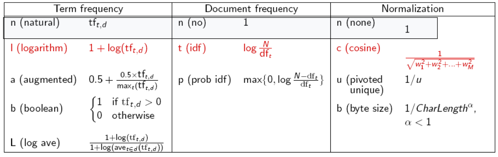

# Week 4: Solutions to Group Exercises on Information Retrieval

1. An IR system returns eight relevant documents and ten non-relevant documents. There are a total of twenty relevant documents in the collection. 
What is the precision of the system on this search, and what is its recall?

   ```
   Precision: 8/18 (or 4/9)
   Recall: 8/20 (or 2/5)
   ```

2. Do modern web search engines use stemming? If so, are all suffixes removed or just some of them? How do search engines deal with Boolean terms like OR or AND? 
Do some experimenting with some search engines.

   ```
   Google and Bing do not use exactly use stemming, since searches for words with different suffixes return different 
   results. But they clearly do some sort of lemmatization, since searches for words do return pages that only 
   have the words in different forms. These search engines also distinguish between OR and AND.
   ```

3. Compute cosines to find out whether Doc1, Doc2, or Doc3 will be ranked higher for the two-word query "Linus pumpkin", 
given these counts for the (only) 3 documents in the corpus:

   | Term    | Doc1 | Doc2 | Doc3 |
   |:--------|:----:|:----:|:----:|
   | Linus   | 10   | 0    | 1    |
   | Snoopy  | 1    | 4    | 0    |
   | pumpkin | 4    | 100  | 10   |

   Do this by computing the tf-idf cosine between the query and Doc1, the cosine between the query and Doc2, and the cosine between the query and Doc3, 
and choose the highest value. **You should use the ltc.lnn weighting variation (remember that's ddd.qqq), the same weighting you will use for PA3,** using the following table:

   

   **Hint:**
   - Logs are in base 10!
   - It might help to look at this [useful handout](CS124_IR_Handout.pdf)

   ```
   Let's start with our query "Linus pumpkin".
   
   |  term   | tf-raw |     tf-wt      |
   |---------|--------|----------------|
   | Linus   |   1    | 1 + log(1) = 1 |
   | pumpkin |   1    | 1 + log(1) = 1 |
   
   We don't need to do anything else for the query vector because we are simply using lnn weights.
   
   Now let's do our calculations for Doc 1.
   
   |  term   | tf-raw |       tf-wt        | df |       idf        |        wt         |                  normalized                   |
   |---------|--------|--------------------|----|------------------|-------------------|-----------------------------------------------|
   | Linus   |   10   | 1 + log(10) = 2    | 2  | log(3/2) = 0.176 | 2 x 0.176 = 0.352 | 0.352 / sqrt(0.352^2 + 0.176^2 + 0^2) = 0.894 |
   | Snoopy  |   1    | 1 + log(1) = 1     | 2  | log(3/2) = 0.176 | 1 x 0.176 = 0.176 | 0.176 / sqrt(0.352^2 + 0.176^2 + 0^2) = 0.447 |
   | pumpkin |   4    | 1 + log(4) = 1.602 | 3  | log(3/3) = 0     | 1.602 x 0 = 0     | 0 / sqrt(0.352^2 + 0.176^2 + 0^2) = 0         |
   
   Now calculations for Doc 2.
   
   |  term   |  tf-raw  |       tf-wt        | df |       idf        |          wt           |           normalized            |
   |---------|----------|--------------------|----|------------------|-----------------------|---------------------------------|
   | Linus   |   0      | 0                  | 0  | 0                | 0                     | 0                               |
   | Snoopy  |   4      | 1 + log(4) = 1.602 | 2  | log(3/2) = 0.176 | 1.602 x 0.176 = 0.282 | 0.282 / sqrt(0.282^2 + 0^2) = 1 |
   | pumpkin |   100    | 1 + log(100) = 3   | 3  | log(3/3) = 0     | 3 x 0 = 0             | 0 / sqrt(0.282^2 + 0^2) = 0     |
   
   Now calculations for Doc 3.
   
   |  term   | tf-raw |     tf-wt       | df |       idf        |        wt         |           normalized            |
   |---------|--------|-----------------|----|------------------|-------------------|---------------------------------|
   | Linus   |   1    | 1 + log(1) = 1  | 2  | log(3/2) = 0.176 | 1 x 0.176 = 0.176 | 0.176 / sqrt(0.176^2 + 0^2) = 1 |
   | Snoopy  |   0    | 0               | 0  | 0                | 0                 | 0                               |
   | pumpkin |   10   | 1 + log(10) = 2 | 3  | log(3/3) = 0     | 2 x 0 = 0         | 0 / sqrt(0.176^2 + 0^2) = 0     |
   
   Now for the cosine similarity of each document, we take the dot product of the query vector and the normalized 
   vector for that document. We can disregard the Snoopy element in each of the documents vectors becasue the 
   query vector does not contain the word Snoopy. As such, we get the following:
   
   Doc1: (1 x 0.894) + (1 x 0) = 0.894
   Doc2: (1 x 0) + (1 x 0) = 0
   Doc3: (1 x 1) + (1 x 0) = 1
   
   Now we simply choose the highest score and that belongs to Doc3. Doc3 will be ranked highest for the query 
   "Linus pumpkin", because between Doc1, Doc2, and Doc3, we see that Doc3 has a greater cosine similarity
   ```

4. **Privacy** in IR: Personalization is an important topic in information retrieval; after all, we'd like our search results to be relevant to us and our interests.
 However, as with many other tasks involving people's personal data, this has ethical implications. Do the following in your group:
   1. Google "marguerite". What is the first search result? Would you expect another person - say, someone in New York - to get the same search result? 
Discuss any incidents in which your group members have had search engines return such examples of personalization based on location, search and browsing history, or social media?
   
   2. Discuss these questions:
      1. Is it okay that search engines are using this data to personalize our searches? Or is there a limit to what kind of data should be okay for search engines to use? 
Does any of your group use anonymous search engines to avoid this?
      2. Are there any risks with getting personalized searches? Or do the benefits outweigh the risks? What about using people's queries about HIV or opioids 
for public health research? How should decide how to weigh benefits against risks?
      3. In 2009, the French government signed the ["Charter of good practices on the right to be forgotten on social networks and search engines"](https://fr.wikisource.org/wiki/Charte_du_droit_%C3%A0_l%E2%80%99oubli_dans_les_sites_collaboratifs_et_les_moteurs_de_recherche). 
      Do you think people should have the right to remove information about themselves from the web (the right to be forgotten)? 
Do you think Google should be required to remove information about an individual upon request?

4. **Bias** in IR. Google "professor style" and select "Images". Google "teacher style" and select "Images"
   1. What do you notice about the results? Do you notice any biases in the image results?
   2. What do you think are the impacts of potential misrepresentation in results? Discuss!!  

      You can check out these additional resources if you are looking for more readings about the impact of advertising, media, and search results 
on the perception of different identity groups. If you would like, you can use these articles to guide your discussion.
      - https://www.tandfonline.com/doi/abs/10.1080/00913367.1990.10673179
      - https://journals.sagepub.com/doi/10.1177/002193479902900303
      - https://psycnet-apa-org.stanford.idm.oclc.org/fulltext/2020-42793-001.html
      - https://journals.sagepub.com/doi/abs/10.1177/1090198120957949
