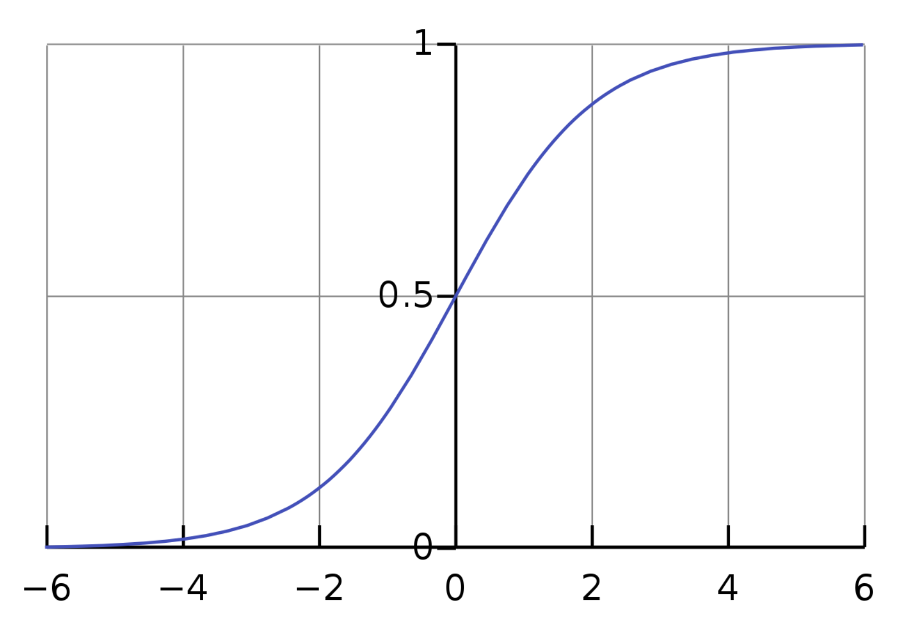

# Lab 2: Logistic Regression (Solutions)

<sub><sup>*written by riya karumanchi & isabel sieh, cs124 staff team, winter '25/'26*</sup></sub>

## Part 1: Sigmoid Intuition

First, form a group of 3 students to work together! Introduce yourselves to one another.

In logistic regression, we compute a real-valued score

$$
z = w\cdot x + b
$$

and then turn it into a probability using the sigmoid (logistic) function

$$
\hat{y} = s(z)=\frac{1}{1+\exp(-z)}.
$$

Where $\exp(-z) = e^{-z}$.

**$z$** can be any real number, but **$s(z)$** is always between 0 and 1, and it "squashes" large-magnitude values toward 0 or 1.

### A. "Same sign, different confidence"

With your group, work through this part. This is meant to be straightforward—it's a sanity check to make sure you can interpret the sigmoid curve correctly. Look at the sigmoid function plotted below:



* We call $z$, the input to the sigmoid, the **"logit"**.

Below are three different scores ($z$). Using the figure above, rank the predicted probabilities ($\hat{y}=s(z)$) from largest to smallest, and briefly justify using only the *shape* of the sigmoid:

1. $z = 0.2$
2. $z = 2$
3. $z = 6$

**Question 1.** Which one has the highest probability of $y=1$? Which one has the lowest? Why?

```
# Answer below
```

Rank the probabilities:

$$
s(6) > s(2) > s(0.2).
$$

- Highest probability of $y=1$: $z=6$
- Lowest probability of $y=1$: $z=0.2$

Justification: sigmoid is increasing; larger $z$ corresponds to larger $s(z)$.

**Question 2.** Which pair is *closer together* as probabilities: $s(0.2)$ vs $s(2)$, or $s(2)$ vs $s(6)$? Why?

```
# Answer below
```

Which pair is closer together as probabilities?

$$
s(2)\ \text{vs}\ s(6)\ \text{are closer}.
$$

Justification: the sigmoid curve is **flatter for large positive $z$** (saturation), so increasing $z$ from 2 to 6 changes probability less than increasing $z$ from 0.2 to 2.

### B. "How the sigmoid moves points"

Use the following small reference table (you may treat these as given; no calculator needed):

* $s(0)=0.5$
* $s(2)\approx 0.88$
* $s(-2)\approx 0.12$
* $s(4)\approx 0.98$
* $s(-4)\approx 0.02$

**Question 3.** Suppose two different feature vectors produce scores $z=2$ and $z=4$. In terms of probability, how much did the prediction change? What does this illustrate about "squashing"? (One sentence.)

```
# Answer below
```

Compare $z=2$ and $z=4$.

From the table:
- $s(2)\approx 0.88$
- $s(4)\approx 0.98$

So:

$$
\Delta z = +2,\quad \Delta \hat{y} \approx 0.98 - 0.88 = +0.10.
$$

**Key point:** Even though the score $z$ increased by $+2$, the probability only increased by about $+0.10$, illustrating that sigmoid "squashes" large logits, so probabilities show diminishing returns near 0/1 (saturation).

**Question 3b (preview: temperature).** Later in the course, when we work with language models, we will use a **temperature** parameter $t$ (where $0 < t \le 1$) to control how *sharp* or *confident* a model's predicted probabilities are.

In this simplified setting, we apply temperature by dividing the logit by $t$ before applying the sigmoid:

$$
s(z/t) = \frac{1}{1+\exp(-z/t)}.
$$

**Question:** Suppose the model produces logit $z = 4$. Would using a temperature of $t = 0.1$ make the output probability **higher** or **lower** than without temperature (i.e., compared to $s(4)\approx 0.98$)? Briefly explain.

```
# Answer below
```

**Higher.**

With $z=4$ and $t=0.1$:

$$
z/t = 4/0.1 = 40
$$

So $s(40) \approx 1.0$ (very close to 1), which is higher than $s(4) \approx 0.98$.

**Intuition:** A low temperature "sharpens" the sigmoid—it makes the output more extreme (closer to 0 or 1). Dividing by a small $t$ amplifies the logit, pushing the probability toward the extremes.

**Question 4.** Now look at the negative logits: $s(-2) \approx 0.12$ and $s(-4) \approx 0.02$. Compare these to the positive cases $s(2) \approx 0.88$ and $s(4) \approx 0.98$. What pattern do you notice? (Hint: what do $s(2)$ and $s(-2)$ sum to?)

```
# Answer below
```

They sum to 1! For example:
- $s(2) + s(-2) \approx 0.88 + 0.12 = 1$
- $s(4) + s(-4) \approx 0.98 + 0.02 = 1$

This is the **symmetry property** of the sigmoid:

$$
s(-z)=1-s(z)
$$

Logits of equal magnitude but opposite sign produce probabilities that "mirror" around 0.5.

We will now go back to the whole class and discuss group answers for Part 1 in a plenary session.

---

## Part 2: One step of stochastic gradient descent (SGD)

For the following problem, please choose a group facilitator/representative who will also take notes on your discussion.

Each document (sentence/comment) is converted into a feature vector $x$. In this exercise we'll use just one feature, so $x$ will be a single number. The model computes:

* **score (logit):** $z = w \cdot x + b$

  * $x$ is the feature for the document
  * $w$ is the weight for the feature
  * $b$ is a bias term (a constant offset)

* **predicted probability:** $\hat{y} = s(z)$, where

  $$
  s(z)=\frac{1}{1+\exp(-z)}
  $$

  $\hat{y}$ is the model's predicted probability that $y=1$ for this document.

* **true label:** $y \in \{0,1\}$ is the correct label for the document

  * $y=1$: positive (or "class 1")
  * $y=0$: negative (or "class 0")

The loss we use in lecture is the cross-entropy loss ($L_{CE}$). For a single training example ($(x,y)$), the derivatives of the loss are:

$$
\frac{\partial L_{CE}}{\partial w} = (\hat{y}-y)x \qquad \frac{\partial L_{CE}}{\partial b} = \hat{y}-y
$$

Here is what each term means, in plain language:

* $L_{CE}$: the loss (how "wrong" the model is on this example)
* $w$: the weight for the feature
* $x$: the value of the feature for this document
* $w \cdot x + b$: the score ($z$) (total evidence before applying sigmoid)
* $s(w \cdot x + b)$: the predicted probability ($\hat{y}$)
* $\hat{y}-y$: the "error term" (positive if we predicted too high; negative if we predicted too low)

Finally, stochastic gradient descent (SGD) updates parameters by moving **against** the gradient. 

$$
q \leftarrow q - h g
$$

where:

* $q$ is the parameter vector (it contains $w$ and $b$)
* $h$ is the learning rate
* $g$ is the gradient

---

### Setup

We will classify a movie review comment using a single feature:

* $x$ = number of **positive** words in the comment (from a small positive lexicon)

Consider the comment:

> "The acting was great and the soundtrack was incredible, and the cinematography was amazing."

Assume our positive lexicon contains: {great, incredible, amazing}

So the feature is:

* $x = 3$ (great, incredible, amazing)

We will start with:

* $w = 0$, $b = 0$

So initially:

$$
z = w \cdot x + b = 0 \quad\Rightarrow\quad \hat{y}=s(0)=0.5
$$

Let the learning rate be $h = 0.1$.

---

### Case 1: The comment is labeled positive ($y=1$)

1. Compute $\hat{y}-y$ at initialization. Is it positive or negative?

```
# Answer below
```

Compute $\hat{y}-y$:

$$
\hat{y}-y = 0.5 - 1 = -0.5
$$

Negative.

2. Using

   $$
   \frac{\partial L_{CE}}{\partial w} = (\hat{y}-y)x,
   $$

   determine the sign (positive or negative) of $\frac{\partial L_{CE}}{\partial w}$.

```
# Answer below
```

Sign of gradient:

$$
\frac{\partial L_{CE}}{\partial w} = (\hat{y}-y)x = (-0.5)(3) = -1.5 < 0
$$

The gradient is negative.

3. Gradient descent updates:

   $$
   w \leftarrow w - h\frac{\partial L_{CE}}{\partial w}
   $$

   Will $w$ increase or decrease?

```
# Answer below
```

Update subtracts the gradient, so subtracting a negative value increases the weight:
- $w$ increases

(Optional numeric update:)

$$
w \leftarrow 0 - 0.1(-1.5)= +0.15, \quad b \leftarrow 0 - 0.1(-0.5)= +0.05
$$

3b. The bias also updates: $b \leftarrow b - h\frac{\partial L_{CE}}{\partial b}$. Will $b$ increase or decrease?

```
# Answer below
```

Since $\frac{\partial L_{CE}}{\partial b} = \hat{y}-y = -0.5 < 0$, subtracting a negative value increases the bias:
- $b$ increases

4. After this update, will the new score $z = w\cdot x + b$ be larger or smaller than before?
   Therefore, will $\hat{y}=s(z)$ move toward **1** or toward **0**?

```
# Answer below
```

Since $x>0$ and the weight increased, the score $z=w \cdot x+b$ increases. Therefore $\hat{y}=s(z)$ increases and moves toward 1.

(Optional numeric check:)

$$
z_{\text{new}} = (0.15)(3) + 0.05 = 0.50 \Rightarrow \hat{y}_{\text{new}} = s(0.50) > 0.5.
$$

---

### Case 2: The same comment is labeled negative ($y=0$)

Repeat Questions 1–4, but with $y=0$.

5. What is the sign of $\hat{y}-y$ now?

```
# Answer below
```

Compute $\hat{y}-y$:

$$
\hat{y}-y = 0.5 - 0 = +0.5
$$

Positive.

6. Will $w$ increase or decrease?

```
# Answer below
```

Sign of gradient:

$$
\frac{\partial L_{CE}}{\partial w} = (0.5)(3) = 1.5 > 0
$$

Subtracting a positive gradient decreases the weight:
- $w$ decreases

(Optional numeric update:)

$$
w \leftarrow 0 - 0.1(1.5)= -0.15, \quad b \leftarrow 0 - 0.1(0.5)= -0.05
$$

6b. Will $b$ increase or decrease?

```
# Answer below
```

Since $\frac{\partial L_{CE}}{\partial b} = \hat{y}-y = +0.5 > 0$, subtracting a positive value decreases the bias:
- $b$ decreases

7. Will $z$ increase or decrease? Will $\hat{y}$ move toward 1 or toward 0?

```
# Answer below
```

With a positive feature and a smaller (more negative) weight, $z=w \cdot x+b$ decreases. Therefore $\hat{y}=s(z)$ decreases and moves toward 0.

(Optional numeric check:)

$$
z_{\text{new}} = (-0.15)(3) - 0.05 = -0.50 \Rightarrow \hat{y}_{\text{new}} = s(-0.50) < 0.5.
$$

---

### Discussion (one sentence each)

8. In one sentence: explain why $(\hat{y}-y)$ makes sense as an "error signal."

```
# Answer below
```

$(\hat{y}-y)$ is an "error signal" because its sign encodes whether the model is overpredicting or underpredicting:
- if $\hat{y}>y$, then $\hat{y}-y>0$ and the update pushes $z$ down
- if $\hat{y}<y$, then $\hat{y}-y<0$ and the update pushes $z$ up

9. In one sentence: explain why multiplying by $x$ makes sense (why a feature that appears more should change its weight more).

```
# Answer below
```

Multiplying by $x$ makes sense because if the feature appears more in the document (larger $x$), it contributed more to the score $z$ for this example, so the update for its weight $w$ should be larger in magnitude.

We will now go back to the whole class and discuss group answers for Part 2 in a plenary session.

---

## Ethics Discussion

In Parts 1 and 2, you explored how logistic regression computes a probability $\hat{y}$ for movie review sentiment. However, a probability is not a decision. To classify a document, we must choose a classification threshold (or "cutoff"). Typically, the default is 0.5, but in high-stakes domains like hiring, this choice becomes a significant ethical lever.

Imagine you are using your model to screen resumes for a software engineering role. The model outputs the probability $\hat{y}$ that a candidate should move on to a human interview based on a company's historical hiring data.

You must decide where to set the threshold for which candidates move on. If you set a high threshold (e.g., 0.9), you only interview "sure bets" according to the model. If you set it lower (e.g., 0.4), you interview more people, including those the model is unsure about.

In Lab 1, we discussed how the origins of a dataset (like the New York Times Annotated Corpus) can introduce narrow perspectives or historical biases into a model.

10. If you set a very high threshold (e.g., 0.9), how does this choice interact with existing biases in your training data?

```
# Answer below
```

*Discussion question—no single correct answer. Key points to look for:*
- A high threshold amplifies biases in the training data: only candidates who look most like historical "successes" pass
- If historical hiring was biased (e.g., favored certain demographics), the model learns those patterns
- High confidence predictions tend to be for candidates most similar to the majority in the training data

11. If you lower the threshold to 0.3 to be more inclusive, what is the "cost" to the hiring team? How do you narrow in on a fair threshold?

```
# Answer below
```

*Discussion question—no single correct answer. Key points to look for:*
- Cost: more candidates to interview → more time/resources for the hiring team
- Trade-off between inclusivity and efficiency
- Narrowing in on a fair threshold might involve: examining outcomes across demographic groups, consulting stakeholders, iterating based on feedback

12. Beyond accuracy, what are some considerations or metrics a team should look at when deciding on a threshold for a hiring tool? How could you evaluate the fairness of your chosen threshold?

```
# Answer below
```

*Discussion question—no single correct answer. Key points to look for:*
- Metrics: false positive/negative rates across demographic groups, disparate impact analysis, calibration
- Considerations: legal requirements, company values, candidate experience, transparency
- Evaluation approaches: audit outcomes by protected attributes, compare threshold effects across groups, involve diverse stakeholders in the decision
