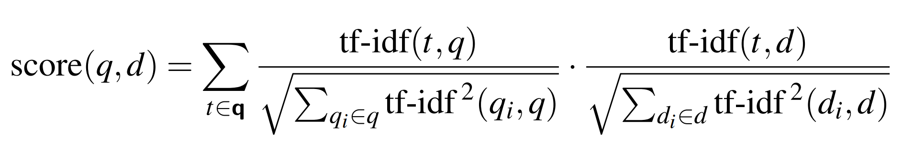
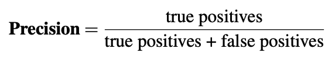
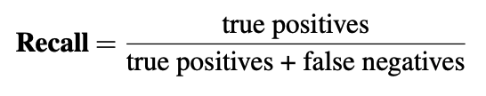

# Lab 3: Information Retrieval (Solutions) (Week 4)

<sub><sup>*written by julia biswas & isha sinha, cs124 staff team, winter '25/'26*</sup></sub>

## Part 1: tf-idf Weighting and Dense Retrieval

First, form a group of 3 students to work together! Introduce yourselves to one another.

### A. tf-idf Ranking

Imagine you are using a simple IR system. It has the following term-document count matrix:

   | Term    | Doc1 | Doc2 |
   |:--------|:----:|:----:|
   | apple   | 3    | 0    | 
   | phone   | 0    | 2    | 
   | fruit   | 2    | 0    | 

You want to manually verify whether Doc1 or Doc2 will be ranked higher for the one-word query “apple”, given these counts for the (only) 2 documents in the corpus. You will do this by computing the tf-idf cosine between the query and Doc1, and the cosine between the query and Doc2, and choose the highest value.

You will use the following equation:

   


This tf-idf cosine score equation is explained in the [Jurafsky textbook](https://web.stanford.edu/~jurafsky/slp3/11.pdf) (Chapter 11, pages 4-8). 

[This spreadsheet](https://docs.google.com/spreadsheets/d/1GmcHc-PP0rQuHV_3CVhyHFzE0tBA8DBWr3gE2j7Ke5g/edit?usp=sharing) contains an example of how to compute the tf-idf score for the example outlined in the textbook on page 8 of Chapter 11. Take a look at it to understand how it uses Excel formulas to implement the math between columns (e.g. tf-idf is the product of the tf and idf columns). 

Once this example makes sense to you, make a **copy** of [this spreadsheet](https://docs.google.com/spreadsheets/d/1cVnvF6pELowuuMkAvZLHMHaIJyd46yqjbSQ9PTi-mX8/edit?usp=sharing), which has the term and document counts for the IR system we’ve outlined above.

**Question 1.** Using the formula given above, fill in the Excel formulas to implement the math between columns for the query ("apple") and Doc1. Once you are done, determine what the cosine similarity is between the query and Doc1.

 ```
0.750
```
You can find the calculations in [this spreadsheet](https://docs.google.com/spreadsheets/d/1bGQbz7Ojwa4_h6Nga310u3zl916KjE2-3IsBPoK9ksI/edit?usp=sharing) or written below:

   For our query "apple":
   
   |  term  | tf-raw |       tf-wt        | df |       idf        |        tf-idf         |                  normalized                   |
   |--------|--------|--------------------|----|------------------|-----------------------|-----------------------------------------------|
   | apple   |   1    | 1 + log(1) = 1 | 1  | log(2/1) = 0.301 | 1 x 0.301 = 0.301 | 0.301 / sqrt(0.301^2 + 0^2 + 0^2) = 1 |
   
   For Doc1:
   
   |  term  | tf-raw |       tf-wt        | df |       idf        |        tf-idf         |                  normalized                   |
   |--------|--------|--------------------|----|------------------|-----------------------|-----------------------------------------------|
   | apple  |   3    | 1 + log(3) = 1.477 | 1  | log(2/1) = 0.301 | 1.477 x 0.301 = 0.445 | 0.445 / sqrt(0.445^2 + 0^2 + 0.392^2) = 0.750 |
   | phone  |   0    | 0                  | 1  | log(2/1) = 0.301 | 0 x 0.301 = 0         | 0 / sqrt(0.445^2 + 0^2 + 0.392^2) = 0         |
   | fruit  |   2    | 1 + log(2) = 1.301 | 1  | log(2/1) = 0.301 | 1.301 x 0.301 = 0.392 | 0.392 / sqrt(0.445^2 + 0^2 + 0.392^2) = 0.661 |

   For the cosine similarity, we take the dot product of the normalized vector for the query and the normalized vector for Doc1, and get `(1 x 0.750)  = 0.750`.

We’ll pause here to check our calculations so far as a class.

**Question 2.** Finish filling in the spreadsheet. Once you are done, determine which document is returned for your one-word query, “apple”, and what the cosine similarity is.

 ```
Doc1; 0.750
```
You can find the calculations in [this spreadsheet](https://docs.google.com/spreadsheets/d/1bGQbz7Ojwa4_h6Nga310u3zl916KjE2-3IsBPoK9ksI/edit?usp=sharing) or written below:

 For Doc2:
   
   |  term  | tf-raw |       tf-wt        | df |       idf        |          tf-idf       |           normalized                  |
   |--------|--------|--------------------|----|------------------|-----------------------|---------------------------------------|
   | apple  |   0    | 0                  | 1  | log(2/1) = 0.301 | 0 x 0.301 = 0         | 0 / sqrt(0^2 + 0.392^2 + 0^2) = 0     |
   | phone  |   2    | 1 + log(2) = 1.301 | 1  | log(2/1) = 0.301 | 1.301 x 0.301 = 0.392 | 0.392 / sqrt(0^2 + 0.392^2 + 0^2) = 1 |
   | fruit  |   0    | 0                  | 1  | log(2/1) = 0.301 | 0 x 0.301 = 0         | 0 / sqrt(0.282^2 + 0^2) = 0           |
   
   For the cosine similarity, we take the dot product of the normalized vector for the query and the normalized vector for Doc2, and get `(1 x 0) = 0`. As we'll recall from **Question 1**, the cosine similarity for Doc1 was 0.750, which is higher, so Doc1 is the returned document.

We will now reconvene as a class to discuss our calculations.

### B. tf-idf vs. Dense Retrieval

Now imagine you're using a dense retrieval system. Suppose the query is still “apple”, and the system is ranking the following two documents: “apple fruit” and “pineapple fruit."

**Question 3.** Explain why the dense retrieval system might assign a non-zero similarity to “pineapple fruit” for the query “apple,”  while our simple IR system would assign it little or no score.

```
Dense retrieval represents words and documents as vectors in a space where semantic similarity (similarity in
meaning) is reflected by closeness. Because “pineapple” and “apple” are both fruits and have related meanings,
their vectors are near each other, so the cosine similarity between the query vector (“apple”) and the
document vector (“pineapple fruit”) is greater than zero. In contrast, tf-idf only counts exact word matches,
so “pineapple” does not match “apple” and contributes nothing to the score.
```

**Question 4.** What does this example illustrate about what dense retrieval captures that tf-idf does not?

```
This example illustrates that dense retrieval captures semantic similarity beyond exact word matches. It
can recognize that words with similar meanings (like “apple” and “pineapple”) are related, while tf-idf only
captures literal word overlap. Dense retrieval can therefore retrieve relevant documents even if they do not
contain the exact query terms.
```

We will now go back to the whole class and discuss group answers for Part 1B in a plenary session.

## Part 2: Precision and Recall

For this next part, have someone take notes for your group so that you are prepared to share. 

Here's a quick refresher on the definition of precision and recall, from the [Jurafsky textbook](https://web.stanford.edu/~jurafsky/slp3/4.pdf) (Chapter 4, pages 22-23):

Precision measures the percentage of the items that the system detected (i.e., the system labeled as positive) that are in fact positive. It asks the question, _"Out of everything the model identified as positive, how many were actually positive?"_ Precision is defined as:

   

Recall measures the percentage of items actually present in the input that were correctly identified by the system. It asks the question, _"Out of all the actual positives, how many did the model catch?"_ If there are false negatives (positives that the model missed), recall will decrease. Recall is defined as:

   

Now, imagine you have a more sophisticated IR system than the one in Part 1, with far more query terms and documents. You are tasked with evaluating its performance and how it might be used for different searches. 

For a particular query, your system returns 8 relevant documents and 10 non-relevant documents. There are a total of 20 relevant documents in the collection.

**Question 5.** What is the precision of the system on this search, and what is its recall?

```
Precision: 8/18 (or 4/9)
Recall: 8/20 (or 2/5)
```

**Question 6.** Precision and recall can be applied to predictions in many real-world applications beyond standard search. However, in real applications there is a tension (tradeoff) between precision and recall, and we often need to decide whether to prioritize one or the other:
* If you prioritize precision for a task, the classifier will minimize false positives, meaning it will try not to mis-identify negative examples as positive.
* If you prioritize recall, the classifier will minimize false negatives, meaning it will try not to mis-identify positive examples as negative.

Pick a real-world application (one from the list below or one of your own) and make an argument for which metric you would prioritize and what the "tension" or tradeoff is in that specific case.

```
Any answer with a logical justification is valid.

Medical Diagnosis: Most students will argue for prioritizing Recall.
    The Argument: In an aggressive disease, a False Negative (missing the disease) is a life-threatening failure.
      You want the model to catch every possible case.
    The Tension: Prioritizing recall leads to more False Positives, meaning healthy patients undergo unnecessary,
      stressful, and expensive follow-up testing.

Criminal Justice: Arguments can be made for either, but many prioritize Precision.
    The Argument: Prioritizing precision minimizes False Positives, ensuring that individuals are not unjustly
      denied bail or kept in jail based on a faulty prediction of future crime.
    The Tension: Prioritizing precision increases False Negatives, meaning the system may fail to identify
      individuals who genuinely pose a risk to public safety before their trial.
```
**Question 7.** Modern AI has shifted from just finding existing documents (Information Retrieval) to creating new content based on learned patterns (Generative AI). This introduces new ethical questions regarding how a system represents historical or social facts.

##### The Pope Example
* **Standard Search**: If you perform a Google Search for "The Pope," the top results will almost exclusively show the current Pope and his predecessors. These results are highly accurate in a literal sense.
* **Generative AI**: In February 2024, Google’s Gemini chatbot faced scrutiny for how it handled historical prompts. You can read the background in this Economist article: [Is Google’s Gemini chatbot woke by accident, or design?](https://www.economist.com/united-states/2024/02/28/is-googles-gemini-chatbot-woke-by-accident-or-design)
* **The Result**: When asked to "generate an image of a Pope," the model provided a diverse range of results, including people of different ethnicities and genders. While this was a deliberate attempt to avoid repeating an alleged demographic bias found in training datasets, it also resulted in historical inaccuracies.

##### The "Mirror" vs. "Aspiration" Framework 
One way to think about this is whether a search engine should act as a "mirror" (reflecting the world exactly as it is/was) or as an "aspiration" (deliberately boosting diverse results to provide a more inclusive view).

**Question 7a.** Compare the results of a Google Search for "The Pope" with the generative AI example above. How does either approach affect the searcher’s potential intent?
```
The Mirror approach (standard search) prioritizes the searcher's intent for historical accuracy. High
precision for the query "Pope" but can reinforce the "erasure" of certain groups from public memory by only
showing what has historically existed.

The Aspiration approach (generative AI) prioritizes inclusive representation but may frustrate a searcher
looking for a specific historical fact, as it introduces elements that did not exist in that context.
```
**Question 7b.** In which specific scenarios would you opt for the mirror approach? In which would you opt for aspiration?

```
Mirror: Historical research, legal documentation, or medical records where accuracy is the primary
safety/functional requirement.

Aspiration: Creative writing, marketing, or children’s media where the goal is to show potential futures
and a broad range of human possibilities.
```
**Question 7c.** The Stereotype Trap: Sometimes, in trying to be "diverse," AI models fall into a stereotype trap—returning the same specific visual style or average representation every time a certain group is mentioned. Does this repetition of stereotypes actually solve the problem of representation, or does it create a new form of bias?
```
No, it often creates a new bias. If diversity is boiled down to a single repetitive archetype (e.g., the same
clothing, setting, or descriptor for every person of x descent), it erases the true diversity within that group
and can create new, flattened stereotypes.
```

We will now go back to the whole class and discuss group answers for Part 2 in a plenary session.

