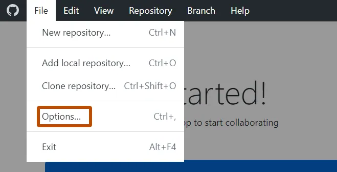
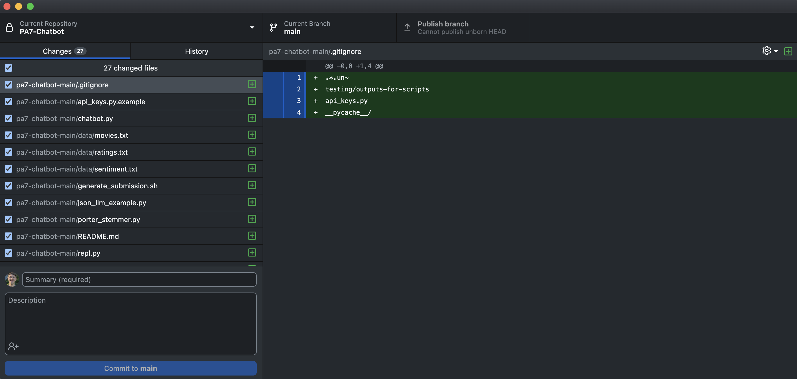
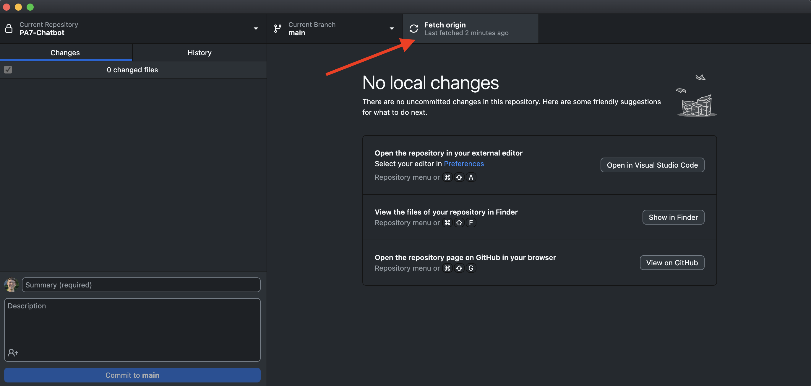
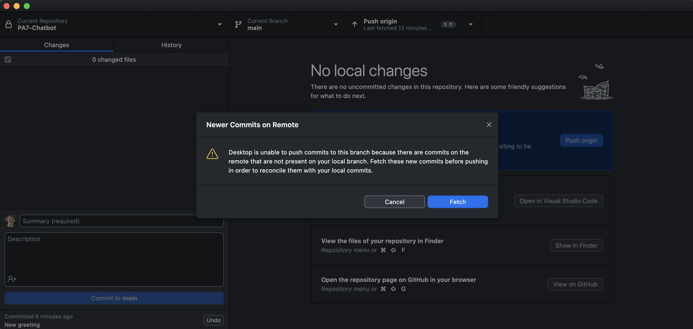

# Week 8: PA7 Overview, Github Setup, Group Norms

Agenda:

- _Reminder: Quiz 8 out today!_
- PA7 Overview (30 minutes): please sit next to your group members for PA7
- Getting started with Github (20 minutes)
- Group Norms (10 minutes)

## Part 1: PA7 Overview

### Introduction to `DSPy`

In PA7 (starter code [here](https://github.com/cs124/pa7-agent)), we will be building a custom movie recommendation agent! We will use the DSPy library to build an agent that can make tool calls (e.g., answer user questions about movies, help user book movie tickets, etc.). While a single LLM can answer natural language queries, an agent is even more powerful as it chains multiple LLM calls to complete complex tasks that often require multiple steps. DSPy is a declarative framework that enables users to build AI software from natural-language modules and compose them with different models. You can read more about DSPy [here](https://dspy.ai/).

For each user query, the agent will first reason about the objective of the task and determine the relevant tools needed to complete the task. Then, the agent will determine the input for each tool call (functions that you will implement) and parse the output back to reason through the process again. Let's walk through an example together:

After you have fully implemented your agent, you can run the REPL script from PA7 to see your agent in action: `python repl.py`. Here is an example of the agent output:

```text
Movie Ticket Agent> Hello! I'm the Movie Ticket Agent. How can I help you today?
> My name is Peter, recommend 3 movies to me.
Movie Ticket Agent>
Prediction(
    trajectory={'thought_0': 'I need to recommend 3 movies to Peter. I will use the recommend_movies tool to generate a list of movie titles for him.', 'tool_name_0': 'recommend_movies', 'tool_args_0': {'user_name': 'Peter', 'k': 3}, 'observation_0': ['Back to the Future (1985)', 'Raiders of the Lost Ark (Indiana Jones and the Raiders of the Lost Ark) (1981)', 'Star Wars: Episode VI - Return of the Jedi (1983)'], 'thought_1': 'I have successfully recommended 3 movies to Peter: "Back to the Future", "Raiders of the Lost Ark", and "Star Wars: Episode VI - Return of the Jedi". Now, I will ask Peter if he would like to book a ticket for any of these movies.', 'tool_name_1': 'finish', 'tool_args_1': {}, 'observation_1': 'Completed.'},
    reasoning='I recommended 3 classic movies to Peter based on his request. The movies are "Back to the Future," "Raiders of the Lost Ark," and "Star Wars: Episode VI - Return of the Jedi." I have completed the recommendation process and am ready to assist him further if he wishes to book a ticket for any of these films.',
    process_result='I have recommended the following 3 movies to you, Peter: "Back to the Future," "Raiders of the Lost Ark," and "Star Wars: Episode VI - Return of the Jedi." Let me know if you would like to book a ticket for any of these!'
)
```

The diagram below outlines the workflow:

```python
User Prompt
    │
    ▼
Prediction()
    │
    ▼
trajectory = {
   thought_i
   tool_name_i
   tool_args_i
   observation_i
}
(repeated loop)
    │
    ▼
reasoning
    │
    ▼
process_result
```

The agent first determines the number of tools needed (i.e. the value of i), then for each tool call, the trajectory displays the input (tool_args_i) and output (observation_i), and the agent reasons through the output to determine the input for the next tool call. Within each tool call, the process looks like the following:

```python
thought_0
  "User wants recommendations → call recommend_movies"

        │
        ▼

tool_name_0 = recommend_movies
tool_args_0 = { user_name: "Peter", k: 3 }

        │
        ▼

observation_0 =
  [
    "Back to the Future (1985)",
    "Raiders of the Lost Ark (1981)",
    "Star Wars: Episode VI - Return of the Jedi (1983)"
  ]

```

The relationship between each tool call is outlined below:

```python
thought_i
    ↓ decides
tool_name_i
    ↓ receives
tool_args_i
    ↓ produces
observation_i
    ↓ informs
thought_(i+1)
```

### Assignment overview

PA7 consists of two parts. In the first part, you will implement a base agent that uses the collaborative filtering algorithm to recommend movies to the user and helps user book movie tickets. In the second part, you will implement an enhanced agent that also takes on web search and memory functionalities.

PA7 is worth 18\% of your total grade, and conveniently split into exactly 100 points, with an additional 5 points of extra credit!

Here's the point breakdown:

- [part 1] (68 Points)
- [part 2] (32 Points)

You can find instructions, rubrics, FAQs, and links to all resources for PA7 [here](https://github.com/cs124/pa7-agent/).

You will have time to discuss with your teammates at the end of today's Lab!

**Before you start:**

- Watch lecture videos up to Recommender Systems and Collaborative Filtering.
- Make sure your team has received together.ai credit.
- Check out the [PA7 Screencast](https://canvas.stanford.edu/courses/217991/files?preview=16650457) for detailed info!
- We will cover GitHub usage later today. Also check out [GitHub Tutorial video](https://canvas.stanford.edu/courses/203819/files/14391706?module_item_id=2052983) by Michael Ryan for step-by-step guidance.

**IMPORTANT ANNOUNCEMENTS:**
- **No late days can be used for PA7!!!** There are no exceptions.
- You will be working with two APIs: Together AI and Serp. Note that each time you run `repl.py`, you will be using up some API credit. Please use your $5 credit wisely! We highly recommend testing your code in `agent.py` in isolation before running `repl.py`.
- We will be using LLM-based grading for the coding portion. You can find more information on this on the assignment page. Wherever the LLM grader docks points, the teaching team will review your code and Gradescope transcript and make manual adjustments to make sure points are awarded back as needed.

## Part 2: Getting started with Github

### Why use Git?

Working on a coding project with a large team can be messy! Everytime you or your teammates make any changes, you need to sync the files with everyone. What if two of you make changes at the same time? That's why we need version control tools like Git. Git allows you to:

- Manage the changes made by collaborators easily.
- View the full history of code changes and revert to earlier version.

Git has a lot of jargon and can be confusing. We have prepared an (optional) [handbook](https://docs.google.com/document/d/1iydelsyAJvKXhxFVoc7sMinqlYZDCm_xcOfe-s4wEYc/edit?usp=sharing) for your reference in case you get lost.

We will use Git with GitHub!

If you don't have a Github account yet, make one [here](https://github.com/)! **Everyone in your group will need a GitHub account.** We have found that chrome and edge work better for this than safari due to GitHub's unique captcha test. After account creation any browser should work fine!

Also be sure to install [Github desktop](https://desktop.github.com) which will be our tool of choice for connecting to GitHub and sending/recieving updates to our codebase.

### Step 1: Creating a Private Repository

Only one person in your group needs to do steps 1 and 2. Navigate to the [new repository creation page](https://github.com/new) on GitHub.


You can call the repository whatever you'd like but be sure to mark it as a `Private` repository since we'll be storing your project code here.

Leave the rest of the settings to their defaults and click `Create repository`.

### Step 2: Inviting Collaborators

Click the `Invite collaborators` button to invite your group partners to the repository.


Under `Manage access` click `Add people`. Search for your partners and add them to the repository. You can add them with `Admin` access. They will need to check their email for an invitation.

### Step 3: Setting up GitHub Desktop

**All Group Members should follow this step!**

Open up Github Desktop which you can download [here](https://desktop.github.com).

Sign in to GitHub Desktop. There may be a button to do so when you first open it, but if not you can still sign in through the menu. If you are on mac, click `GitHub Desktop` and then `Settings`.


Then click `Sign Into GitHub.com`.

If you are on Windows, click `File` then `Options`



Then click `Sign In` under `GitHub.com`, not GitHub Enterprise.

Sign in with your browser and enable the permissions requested for GitHub Desktop.

### Step 4: Setting up your Local Repository

**All Group Members should follow this step!**

If this is your first time using Github Desktop you may see a `Clone a repository from the internet` button


Otherwise you'll find the `Clone` button under `Current Repository`, `Add`, `Clone Repository`

There you'll find the option to clone `Your Repositories` from GitHub.com. You'll also find repositories that you've been added as a collaborator to.

Choose to `Clone` your group's repository to somewhere convenient on your PC. Choose a path that you'll remember and know where to find!


### Step 5: Adding in the PA7 Files to the Repository

**ONLY ONE GROUP MEMBER SHOULD COMPLETE THIS STEP**

There are several ways we can get the PA7 files into your local repo, but the easiest way without making any assumptions about your setup is to download a zip file from GitHub and extract it into this new local repo we've created!

Navigate to the course [PA7 Repository](https://github.com/cs124/pa7-chatbot) (not the one you just created).

Click `Code` and `Download ZIP`.


This should've downloaded a file `pa7-chatbot-main`. If it is still zipped, be sure to extract the file into a folder.

This is where it is important that you remember the path where you saved your local repository! Drag the `pa7-chatbot-main` folder into the folder where you are storing your repository.

When you return to GitHub desktop you should see all the files are being tracked!



In total there are 15 Tracked Files. Let's upload them to our shared repository!

Add a summary in the lowerleft hand corner to describe the update. This should be a brief message, called a commit message. When we make a commit we save a snapshot of the current version of our codebase! You can call this commit something like `Added starter code`.

Then click `Commit to main`.

This has saved a snapshot of your code locally, but we need to upload it so everyone in your group can access it! Click `Publish branch` which will `push` your changes to GitHub.


### Step 6: Sync the repository

**_Everyone besides the person who completed step 5 needs to complete this step_**.

Where the publish button was for the person making the changes, everyone will find a "Fetch origin" button. Click it!



This will check the GitHub repository for any updates. It should find the changes that one group member just pushed. Everyone should click the button again to "Pull" the changes.

**PAUSE!** Now is an important time to take a moment and check that everything is working! Does everyone have a copy of the repository locally with all the same files? Does your GitHub repository have all of the project files in a private repository? Does everyone in your group have access to the repository? If the answer to any of these questions is no, ask a CA for help!!

### Step 7: Making code changes

**_Everyone in your group should do this step, and do it with slightly different changes_**

Let's go through the typical workflow of making edits to your project and sharing the changes to your group.

First fetch and pull any changes to the code that have been made. This is what you did in Step 6.

Navigate to the `agent.py` file and open it up in your preferred editor. This is going to be the file where you do the bulk of the work for PA7.

You'll find a method in this file `greeting`:

```python
def greeting(self):
    """Return a message that the chatbot uses to greet the user."""
    ########################################################################
    # TODO: Write a short greeting message                                 #
    ########################################################################

    greeting_message = "How can I help you?"

    ########################################################################
    #                             END OF YOUR CODE                         #
    ########################################################################
    return greeting_message
```

You won't need this function for the assignment, but we will use it to test the workflow on Git.

Have everyone in your group write a slightly different greeting message!

Now return to GitHub Desktop:


You should see the change tracked! Just as before we'll add a `commit` message and then `push` to main! (Refer to the last part Step 5 if you're confused).

But wait? For all but one of you you should be seeing this message:



We all changed the same code at the same time... now we have to resolve a `merge conflict`.

Click `Fetch` then `Pull origin`.

### Step 8: Resolving merge conflicts

Often times when working on a shared repository you'll face issues where two people change the same line of code. This results in a `merge conflict`, since `git` doesn't know which version to keep and which to discard.

Let's work through resolving this merge conflict.

Some of your group members should see this message:


There may be an option to open in Visual Studio Code, however this is not necessary. You can resolve a merge conflict in any code editor (even notepad!). Open up `agent.py` in an editor of your choice.

You'll see both versions of the changes:

```python
def greeting(self):
    """Return a message that the chatbot uses to greet the user."""
    ########################################################################
    # TODO: Write a short greeting message                                 #
    ########################################################################

<<<<<< HEAD
    greeting_message = "Hey what's up?"
=======
    greeting_message = "Howdy!  What can I do you for?"
>>>>>> b4eeed1d1ec226b004bf5b55738d112f6cfe8eb0

    ########################################################################
    #                             END OF YOUR CODE                         #
    ########################################################################
```

Choose which one gets to stay and which one has to go! Delete the special characters, and leave the file so that it can execute properly.

Return to GitHub desktop and you should see a message confirming that the merge conflict has been resolved:


Click `Continue Merge` and finish pushing your changes to the remote repository.

### (Optional) Step 9: Together AI API Setup

If you happen to have finished with your GitHub setup early then now would be a great time to follow [this 5 minute guide](https://docs.google.com/document/d/1AzdvSPBlw5BExhPnm4ONfi_tz9EjcbnsrqUtS1Zn1wc/edit?usp=sharing) to get your Together API keys set up for the project!

## Part 4: Setting Group Norms

Communication is the key to success in team work. Communicate your expectations and plans for this project with your teammates! Meanwhile, if you have any questions, the CAs are here to help you. Enjoy!

Below are some tips on effective and efficient group discussion:


<br>


<br>


<br>


<br>


