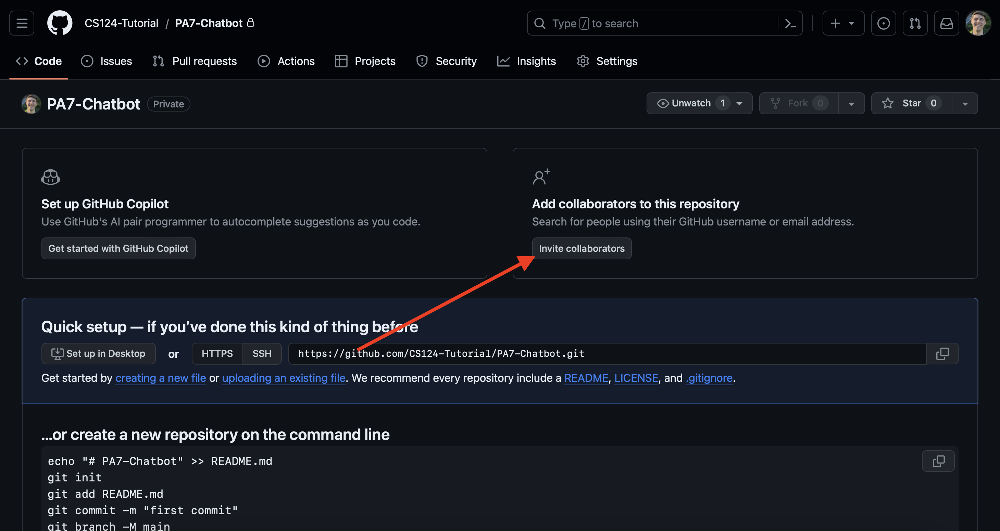

# Week 9: PA7 Overview, Group Exercises on Recommendation Systems, Github Setup, Group Norms

Agenda:
 - *Reminder: Quiz 8 out today!*
 - PA7 Overview (5 minutes)
 - Recommendation Systems Question (30 minutes)
 - Getting started with Github (30 minutes)
 - Group Norms (10 minutes)

## Part 1: PA7 Overview

For PA7 we will be building a custom movie recommendation chatbot!  We will implement our chatbot with 3 different designs: slot-filling dialogue agent (GUS), LLM prompting chatbot, and a hybrid LLM augmented bot.

PA7 is worth 18\% of your total grade, and conveniently split into exactly 100 points!

Here's the point breakdown:
 - [PA7 Coding](https://github.com/cs124/pa7-chatbot?tab=readme-ov-file) (85 Points)
 - [PA7 User Testing](https://docs.google.com/document/d/1liX4MC5qfBceQB0oCPICgxnRmoH0RKfdq5jmwsp7wRw/edit?usp=sharing) (5 Points)
 - [PA7 Reflection](https://docs.google.com/document/d/1gDKuWzuI3f6Nmue60UqoESsrWIzRK62GmdKRh1_y_DM/edit?usp=sharing) (10 points)

You can find instructions, rubrics, FAQs, and links to all resources for PA7 coding in the [PA7 GitHub README page](https://github.com/cs124/pa7-chatbot?tab=readme-ov-file).

All submissions will be made through gradescope.  **Note that no late days can be used for PA7!!!**

You will have time to discuss with your teammates at the end of today's Lab!

**Before you start:**
- Watch lecture videos up to Chatbots & Recommender Systems.
- Make sure your team has received together.ai credit.
- Check out the [PA7 Screencast](https://canvas.stanford.edu/courses/203819/files/14775807?module_item_id=2129781) for detailed info!
- We will cover GitHub usage later today. Also check out [GitHub Tutorial video](https://canvas.stanford.edu/courses/203819/files/14391706?module_item_id=2052983) by Michael Ryan for step-by-step guidance.

## Part 2: Collaborative Filtering

Let's work through an example of item-item collaborative filtering similar to what will be used in PA7:

It will help to make a copy and follow along in [this spreadsheet](https://docs.google.com/spreadsheets/d/1RalPHyrnGHc3dGnDVzAZNZG4uNiZxrcMiO--Xo8awsw/edit#gid=0).

Let's say we have this matrix of movie reviews from various users:

|    | U1 | U2 | U3 | U4 |
|----|---:|---:|---:|---:|
| M1 |  1 |  5 |  3 |    |
| M2 |    |    |  5 |  4 |
| M3 |  2 |  4 |    |  1 |
| M4 |    |  2 |  4 |    |
| M5 |    |  4 |  3 |  4 |
| M6 |  1 |    |  3 |    |

We have a new user with the following preferences:

U = [M1: ??, M2: ??, M3: 5, M4: 2, M5: 3, M6: ??]

Out of the movies they have not seen (M1, M2, and M6) we want to recommend the film that they are likely to rate the highest.

### Step 1.  Binarize the Ratings

Start by binarizing the ratings!  We will use the following cutoffs (same as PA7):

0 $\lt$ rating $\leq$ 2.5: **-1**

Unrated: **0**

2.5 $\lt$ rating $\leq$ 5: **1**

We fill out this table for you in the interest of time!  Please ensure you understand how we got this matrix!

Binarized Matrix:
|    | U1 | U2 | U3 | U4 |
|----|---:|---:|---:|---:|
| M1 | -1 |  1 |  1 |  0 |
| M2 |  0 |  0 |  1 |  1 |
| M3 | -1 |  1 |  0 | -1 |
| M4 |  0 | -1 |  1 |  0 |
| M5 |  0 |  1 |  1 |  1 |
| M6 | -1 |  0 |  1 |  0 |


New User:
| movie | binarized rating |
|-------|------------------|
|    M1 |                0 |
|    M2 |                0 |
|    M3 |                1 |
|    M4 |               -1 |
|    M5 |                1 |
|    M6 |                0 |


### Step 2: Compute Similarity Scores

**Important Note:** In lecture and Quiz 8, you will use mean-centered overlapping cosine similarity. But here (and in PA7), we will use raw cosine similarity, NOT mean-centered overlapping item cosine similarity.

Recall the formula for the cosine similarity of two vectors:

$$\texttt{sim}(v_1,v_2) = \frac{v_1 \cdot v_2}{||v_1||||v_2||} = \frac{v_1 \cdot v_2}{\sqrt{\sum\nolimits_{i=1}^{n} v_{1,i}^{2}} \cdot \sqrt{\sum\nolimits_{i=1}^{n} v_{2,i}^{2}}}$$

Use the binarized vectors when computing the cosine similarity.  We provide a few of the calculations for you, fill in the similarities for $\texttt{sim}(M1, M3)$, $\texttt{sim}(M1, M5)$, and $\texttt{sim}(M5, M6)$.

Note this is a symmetric matrix, that is $\texttt{sim}(M1,M2) = \texttt{sim}(M2,M1)$.

Compute the cosine similarity over all the ***MOVIE*** (item) vectors.  These are the rows of the above matrix.

|    | M1 | M2 |            M3 |           M4 |           M5 |          M6 |
|----|---:|---:|--------------:|-------------:|-------------:|------------:|
| M1 |  1 | 0.41 |          **??** |            0 |         **??** |        0.82 |
| M2 |    |  1 | -0.41         | 0.5          | 0.82         |         0.5 |
| M3 |    |    |             1 |        -0.41 |            0 |        0.41 |
| M4 |    |    |               |            1 |            0 |         0.5 |
| M5 |    |    |               |              |            1 |         **??**  |
| M6 |    |    |               |              |              |          1  |

$\texttt{sim}(M1, M3)$ = ??

$\texttt{sim}(M1, M5)$ = ??

$\texttt{sim}(M5, M6)$ = ??

### Step 3: Compute New User's Ratings

**Important Note:** In lecture and Quiz 8, you will normalize the rating by dividing the sum of the similarity scores. But here (and in PA7), we will NOT do normalization.

Based on the New User's provided ratings for movies 3, 4, and 5, predict how they would rate movies 1, 2, and 6.

We will take the weighted average over the binarized ratings of all movies rated by the new user.  We will weigh on similarity.

For example the predicted rating for movie 2 is:

$\texttt{Rating}(M2) = \texttt{sim}(M2,M3) \cdot \texttt{binarized rating M3} + $
$\texttt{sim}(M2,M4) \cdot \texttt{binarized rating M4} + $
$\texttt{sim}(M2,M5) \cdot \texttt{binarized rating M5}$

$\texttt{Rating}(M2) = (-0.41)(1) + (0.5)(-1) + (0.82)(1) = -0.09$

Now you calculate for M1 and M6.

### Step 4: Recommend a Movie

Now that we have the expected ratings of the user for the movies they have not seen we need to actually recommend a movie.  Recommend the movie with the highest predicted rating!

## Part 3: Getting started with Github

If you don't have a Github account yet, make one [here](https://github.com/)!  **Everyone in your group will need a GitHub account.**  We have found that chrome and edge work better for this than safari due to GitHub's unique captcha test.  After account creation any browser should work fine!

Also be sure to install [Github desktop](https://desktop.github.com) which will be our tool of choice for connecting to GitHub and sending/recieving updates to our codebase.

### Step 1: Creating a Private Repository

Only one person in your group needs to do steps 1 and 2.  Navigate to the [new repository creation page](https://github.com/new) on GitHub.


You can call the repository whatever you'd like but be sure to mark it as a `Private` repository since we'll be storing your project code here.

Leave the rest of the settings to their defaults and click `Create repository`.

### Step 2: Inviting Collaborators

Click the `Invite collaborators` button to invite your group partners to the repository.



Under `Manage access` click `Add people`.  Search for your partners and add them to the repository.  You can add them with `Admin` access.  They will need to check their email for an invitation.

### Step 3: Setting up GitHub Desktop

**All Group Members should follow this step!**

Open up Github Desktop which you can download [here](https://desktop.github.com).

Sign in to GitHub Desktop.  There may be a button to do so when you first open it, but if not you can still sign in through the menu.  If you are on mac, click `GitHub Desktop` and then `Settings`.


Then click `Sign Into GitHub.com`.

If you are on Windows, click `File` then `Options`


Then click `Sign In` under `GitHub.com`, not GitHub Enterprise.

Sign in with your browser and enable the permissions requested for GitHub Desktop.

### Step 4: Setting up your Local Repository

**All Group Members should follow this step!**

If this is your first time using Github Desktop you may see a `Clone a repository from the internet` button


Otherwise you'll find the `Clone` button under `Current Repository`, `Add`, `Clone Repository`

There you'll find the option to clone `Your Repositories` from GitHub.com.  You'll also find repositories that you've been added as a collaborator to.

Choose to `Clone` your group's repository to somewhere convenient on your PC.  Choose a path that you'll remember and know where to find!


### Step 5: Adding in the PA7 Files to the Repository

**ONLY ONE GROUP MEMBER SHOULD COMPLETE THIS STEP**

There are several ways we can get the PA7 files into your local repo, but the easiest way without making any assumptions about your setup is to download a zip file from GitHub and extract it into this new local repo we've created!

Navigate to the course [PA7 Repository](https://github.com/cs124/pa7-chatbot) (not the one you just created).

Click `Code` and `Download ZIP`.


This should've downloaded a file `pa7-chatbot-main`.  If it is still zipped, be sure to extract the file into a folder.

This is where it is important that you remember the path where you saved your local repository!  Drag the `pa7-chatbot-main` folder into the folder where you are storing your repository.

When you return to GitHub desktop you should see all the files are being tracked!


In total there are 27 Tracked Files.  Let's upload them to our shared repository!

Add a summary in the lowerleft hand corner to describe the update.  This should be a brief message, called a commit message.  When we make a commit we save a snapshot of the current version of our codebase!  You can call this commit something like `Added starter code`.

Then click `Commit to main`.

This has saved a snapshot of your code locally, but we need to upload it so everyone in your group can access it!  Click `Publish branch` which will `push` your changes to GitHub.


### Step 6: Sync the repository

***Everyone besides the person who completed step 5 needs to complete this step***.

Where the publish button was for the person making the changes, everyone will find a "Fetch origin" button.  Click it!


This will check the GitHub repository for any updates.  It should find the changes that one group member just pushed.  Everyone should click the button again to "Pull" the changes.

**PAUSE!** Now is an important time to take a moment and check that everything is working!  Does everyone have a copy of the repository locally with all the same files?  Does your GitHub repository have all of the project files in a private repository?  Does everyone in your group have access to the repository?  If the answer to any of these questions is no, ask a CA for help!!

### Step 7: Making code changes
***Everyone in your group should do this step, and do it with slightly different changes***

Let's go through the typical workflow of making edits to your project and sharing the changes to your group.

First fetch and pull any changes to the code that have been made.  This is what you did in Step 6.

Navigate to the `chatbot.py` file and open it up in your preferred editor.  This is going to be the file where you do the bulk of the work for PA7.

You'll find a method in this file `greeting`:

```python
def greeting(self):
    """Return a message that the chatbot uses to greet the user."""
    ########################################################################
    # TODO: Write a short greeting message                                 #
    ########################################################################

    greeting_message = "How can I help you?"

    ########################################################################
    #                             END OF YOUR CODE                         #
    ########################################################################
    return greeting_message
```

This is the message that your chatbot will display to initiate the conversation.  

Have everyone in your group write a slightly different greeting message!

Now return to GitHub Desktop:


You should see the change tracked!  Just as before we'll add a `commit` message and then `push` to main!  (Refer to the last part Step 5 if you're confused).

But wait?  For all but one of you you should be seeing this message:


We all changed the same code at the same time... now we have to resolve a `merge conflict`.

Click `Fetch` then `Pull origin`.

### Step 8: Resolving merge conflicts

Often times when working on a shared repository you'll face issues where two people change the same line of code.  This results in a `merge conflict`, since `git` doesn't know which version to keep and which to discard.

Let's work through resolving this merge conflict.

Some of your group members should see this message:


There may be an option to open in Visual Studio Code, however this is not necessary.  You can resolve a merge conflict in any code editor (even notepad!).  Open up `chatbot.py` in an editor of your choice.

You'll see both versions of the changes:

```python
def greeting(self):
    """Return a message that the chatbot uses to greet the user."""
    ########################################################################
    # TODO: Write a short greeting message                                 #
    ########################################################################

<<<<<< HEAD
    greeting_message = "Hey what's up?"
=======
    greeting_message = "Howdy!  What can I do you for?"
>>>>>> b4eeed1d1ec226b004bf5b55738d112f6cfe8eb0

    ########################################################################
    #                             END OF YOUR CODE                         #
    ########################################################################
```

Choose which one gets to stay and which one has to go!  Delete the special characters, and leave the file so that it can execute properly.

Return to GitHub desktop and you should see a message confirming that the merge conflict has been resolved:


Click `Continue Merge` and finish pushing your changes to the remote repository.

### (Optional) Step 9: Together AI API Setup

If you happen to have finished with your GitHub setup early then now would be a great time to follow [this 5 minute guide](https://docs.google.com/document/d/1N5chC5b15ls-XXcpfjhSx71854fmvb_4DGD4qxkT0LU/edit) to get your Together API keys set up for the project!

## Part 4: Setting Group Norms

Communication is the key to success in team work. Communicate your expectations and plans for this project with your teammates!  Meanwhile, if you have any questions, the CAs are here to help you. Enjoy!
